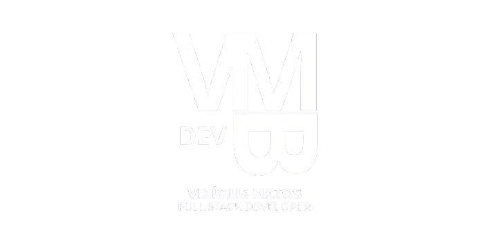

<!--
  README de perfil — Vinicius Matos
  GitHub: https://github.com/ViniciusMat0s
-->

<div align="center">



  <br>

  <h1>Vinicius Matos</h1>

  <p>
    <strong>Software Engineer · Full Stack · SaaS · Produtos com IA</strong>
  </p>

  <a href="https://readme-typing-svg.demolab.com">
    
  </a>

<br><br>

  <a href="https://www.linkedin.com/in/vin%C3%ADcius-matos-57845325a/">
    
  </a>

  <a href="mailto:vinibmatos@rede.ulbra.br?subject=Ol%C3%A1%2C%20Vinicius!">
    
  </a>

  <a href="https://wa.me/5551989544006">
    
  </a>

  <a href="https://github.com/ViniciusMat0s?tab=repositories">
    
  </a>

</div>

<br>

## Sobre mim

Sou **Software Engineer com atuação Full Stack**, focado na construção de produtos digitais modernos, aplicações web escaláveis, plataformas SaaS, sistemas internos e soluções orientadas por inteligência artificial.

Atuo em diferentes etapas do desenvolvimento de um produto, desde a definição da arquitetura e experiência da interface até APIs, banco de dados, integrações externas, automações, infraestrutura e publicação em produção.

Meu trabalho combina **engenharia de software, visão de produto, UI/UX, performance, segurança e automação** para transformar problemas reais em soluções digitais sustentáveis.

* Desenvolvimento de aplicações com **Next.js, React, TypeScript e Node.js**.
* Construção de plataformas **SaaS, multi-tenant, dashboards, CRMs e sistemas de gestão**.
* Integração com APIs, pagamentos, WhatsApp, inteligência artificial e serviços externos.
* Criação de interfaces modernas, responsivas, reutilizáveis e orientadas à conversão.
* Interesse contínuo em **arquitetura, DevOps, cloud, observabilidade e cybersecurity**.
* Experiência com desenvolvimento do planejamento inicial ao ambiente de produção.

<br>

## Stack principal

<div align="center">


</div>

<br>

## Ecossistema e outros conhecimentos

<div align="center">


</div>

<br>

## Áreas de atuação

<table>
  <tr>
    <td width="50%" valign="top">
      <h3>⚙️ Engenharia Full Stack</h3>
      <p>
        Aplicações web completas, APIs, bancos de dados, autenticação,
        autorização e integrações externas.
      </p>
    </td>
    <td width="50%" valign="top">
      <h3>🏗️ Arquitetura de software</h3>
      <p>
        Estruturação de sistemas escaláveis, modularização, multi-tenancy,
        segurança e decisões técnicas sustentáveis.
      </p>
    </td>
  </tr>
  <tr>
    <td width="50%" valign="top">
      <h3>🤖 IA e automações</h3>
      <p>
        Produtos com inteligência artificial, agentes, chatbots, processamento
        de dados e automação de processos.
      </p>
    </td>
    <td width="50%" valign="top">
      <h3>☁️ DevOps e infraestrutura</h3>
      <p>
        Docker, CI/CD, serviços cloud, bancos gerenciados, deploy,
        monitoramento e ambientes de produção.
      </p>
    </td>
  </tr>
  <tr>
    <td width="50%" valign="top">
      <h3>🎨 UI/UX e produto</h3>
      <p>
        Interfaces premium, responsividade, acessibilidade, performance,
        design systems e experiência orientada à conversão.
      </p>
    </td>
    <td width="50%" valign="top">
      <h3>🛡️ Segurança</h3>
      <p>
        Autenticação, autorização, isolamento de dados, validação de entrada,
        segurança de APIs e práticas de DevSecOps.
      </p>
    </td>
  </tr>
</table>

<br>

## Atualmente explorando

```text
▸ Arquitetura de plataformas SaaS e multi-tenant
▸ Segurança de aplicações, APIs e infraestrutura
▸ DevOps, containers, CI/CD e observabilidade
▸ Produtos e automações orientados por inteligência artificial
▸ Performance, acessibilidade e experiência do usuário
```

<br>

## Estatísticas do GitHub

<div align="center">

  <picture>
    <source
      media="(prefers-color-scheme: dark)"
      srcset="https://github-stats-extended.vercel.app/api?username=ViniciusMat0s&show_icons=true&include_all_commits=true&count_private=true&hide_border=true&bg_color=00000000&title_color=A78BFA&text_color=F8FAFC&icon_color=C084FC"
    />
    <source
      media="(prefers-color-scheme: light)"
      srcset="https://github-stats-extended.vercel.app/api?username=ViniciusMat0s&show_icons=true&include_all_commits=true&count_private=true&hide_border=true&bg_color=00000000&title_color=7C3AED&text_color=1F2937&icon_color=9333EA"
    />
    
  </picture>

  <picture>
    <source
      media="(prefers-color-scheme: dark)"
      srcset="https://github-stats-extended.vercel.app/api/top-langs/?username=ViniciusMat0s&layout=compact&langs_count=10&hide_border=true&bg_color=00000000&title_color=A78BFA&text_color=F8FAFC"
    />
    <source
      media="(prefers-color-scheme: light)"
      srcset="https://github-stats-extended.vercel.app/api/top-langs/?username=ViniciusMat0s&layout=compact&langs_count=10&hide_border=true&bg_color=00000000&title_color=7C3AED&text_color=1F2937"
    />
    
  </picture>

  <br>

  <picture>
    <source
      media="(prefers-color-scheme: dark)"
      srcset="https://streak-stats.demolab.com?user=ViniciusMat0s&hide_border=true&background=00000000&ring=A78BFA&fire=C084FC&currStreakLabel=A78BFA&sideLabels=F8FAFC&dates=94A3B8&currStreakNum=F8FAFC&sideNums=F8FAFC"
    />
    <source
      media="(prefers-color-scheme: light)"
      srcset="https://streak-stats.demolab.com?user=ViniciusMat0s&hide_border=true&background=00000000&ring=7C3AED&fire=9333EA&currStreakLabel=7C3AED&sideLabels=1F2937&dates=64748B&currStreakNum=1F2937&sideNums=1F2937"
    />
    
  </picture>

</div>

<br>

## Contribuições

<div align="center">

  <picture>
    <source
      media="(prefers-color-scheme: dark)"
      srcset="https://raw.githubusercontent.com/ViniciusMat0s/ViniciusMat0s/output/github-contribution-grid-snake-dark.svg"
    />
    <source
      media="(prefers-color-scheme: light)"
      srcset="https://raw.githubusercontent.com/ViniciusMat0s/ViniciusMat0s/output/github-contribution-grid-snake.svg"
    />
    
  </picture>

</div>

<br>

## Vamos construir algo?

Tenho interesse em projetos que envolvam **desenvolvimento de produtos, SaaS, arquitetura de software, automações, inteligência artificial, infraestrutura e segurança**.

<div align="center">

  <a href="https://www.linkedin.com/in/vin%C3%ADcius-matos-57845325a/">
    
  </a>

  <a href="mailto:vinibmatos@rede.ulbra.br?subject=Proposta%20de%20projeto">
    
  </a>

</div>

<br>

<details>
  <summary><strong>Outros canais</strong></summary>

  <br>

  <div align="center">

  <a href="https://www.instagram.com/_matszz/">
    
  </a>

  <a href="https://t.me/ViniMat0s">
    
  </a>

  <a href="https://www.facebook.com/M4tszZ/">
    
  </a>

  </div>

</details>

<br>

<div align="center">

  <sub>
    Code · Product · Architecture · Impact
  </sub>

</div>
